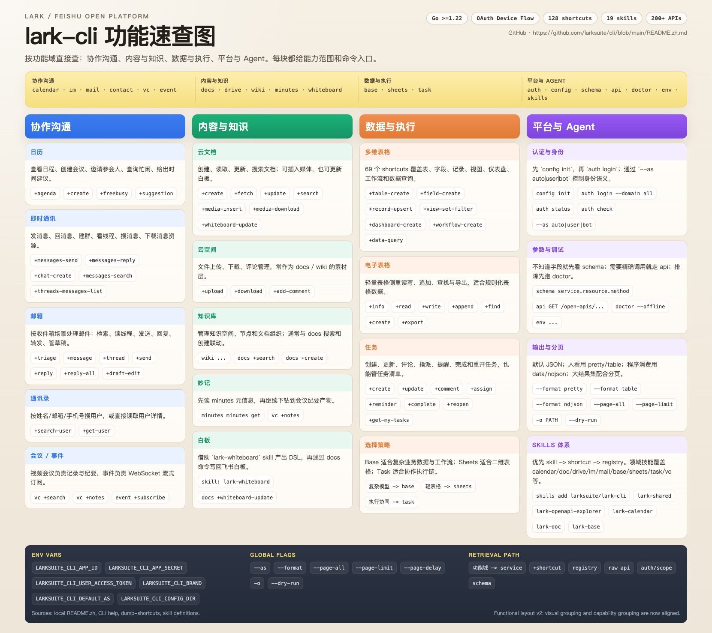

# capability-poster

Local Codex skill for turning a tool or product document into a multi-column functional capability poster.

## Preview / 样图

Generated from the public `lark-cli` README. 基于公开的 `lark-cli` README 生成。



[Open the preview file](examples/lark-cli-capability-poster.png)

## 中文说明

`capability-poster` 是一个本地 Codex Skill，用来把工具或产品文档整理成多列功能速查海报。

### 它会做什么

- 读取公开 URL 或当前上下文里的粘贴内容
- 归一化为固定的功能海报 JSON 结构
- 生成 `poster_data.json`
- 渲染 `poster.html`
- 在可用时继续渲染 `poster.png`

### 默认安装位置

建议安装到：

- `$CODEX_HOME/skills/capability-poster`
- 如果没有设置 `CODEX_HOME`，则使用 `~/.codex/skills/capability-poster`

### 示例用法

```text
$capability-poster https://github.com/larksuite/cli/blob/main/README.zh.md
$capability-poster https://cli.github.com/manual/ capability poster
$capability-poster https://example.com/docs 功能优先 16:9
$capability-poster
根据上下文生成一张功能速查海报
```

### 预期输出

默认输出目录：

```text
output/capability-poster/
  poster_data.json
  poster.html
  poster.png
```

### 替换模板

默认模板文件：

```text
assets/template-functional-v2.html
```

如果后续要更换视觉样式：

1. 保持 v1 JSON schema 不变。
2. 只替换模板中的 HTML/CSS/JS。
3. 保留模板里的 `__POSTER_DATA__` 占位符。
4. 用一份已知可用的示例 JSON 重新验证渲染结果。

### 渲染回退

`scripts/render.py` 会优先生成 HTML 预览。

如果 Python `playwright` 不可用：

- 仍然保留 `poster.html`
- 输出回退提示
- 只要 HTML 成功生成，脚本就不会因为 PNG 缺失而失败

此时可以手动截图，或再用浏览器自动化工具导出 PNG。

## What it does

- Reads a public URL or pasted content
- Normalizes it into a fixed functional poster schema
- Produces `poster_data.json`
- Renders `poster.html`
- Tries to render `poster.png`

## Default install location

Install under:

- `$CODEX_HOME/skills/capability-poster`
- or `~/.codex/skills/capability-poster` when `CODEX_HOME` is unset

## Example prompts

```text
$capability-poster https://github.com/larksuite/cli/blob/main/README.zh.md
$capability-poster https://cli.github.com/manual/ capability poster
$capability-poster https://example.com/docs 功能优先 16:9
$capability-poster
根据上下文生成一张功能速查海报
```

## Expected outputs

Default output directory:

```text
output/capability-poster/
  poster_data.json
  poster.html
  poster.png
```

## Swapping the template

The default template is:

```text
assets/template-functional-v2.html
```

To change the visual system:

1. Keep the v1 JSON schema stable.
2. Replace the HTML/CSS/JS in the template.
3. Keep the `__POSTER_DATA__` placeholder in the template.
4. Re-run the renderer against a known example JSON.

## Rendering fallback

`scripts/render.py` always writes the HTML preview first.

If Python `playwright` is unavailable:

- the script keeps `poster.html`
- prints a fallback message
- does not fail as long as the HTML preview was generated

That HTML can then be screenshotted manually or with browser automation tools.
